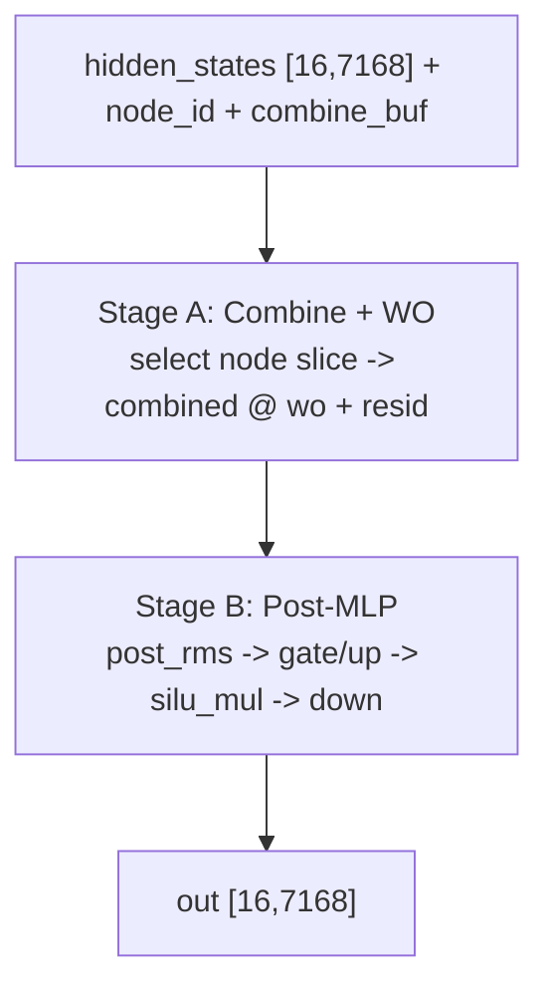
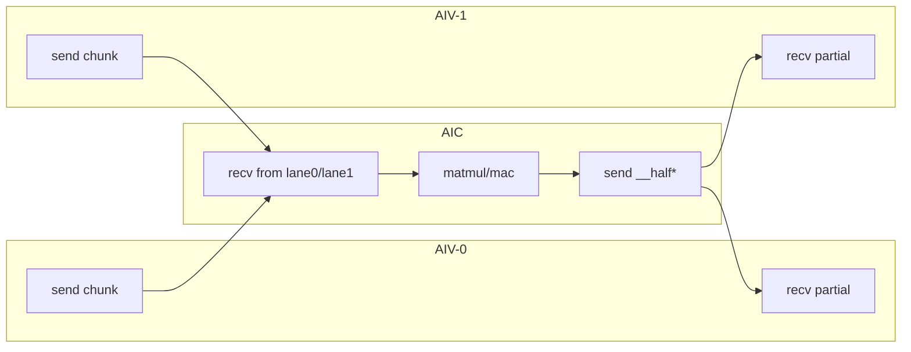

# DeepSeek v3.2 Decode Back Kernel Flow Analysis (Pass08)

## 1. Scope
- Source IR: `deepseek_v3_2_decode_back_dump/passes_dump/08_after_ExpandMixedKernel.py`
- Function: `deepseek_v3_2_decode_back_layer`
- IO shape: input `[16, 7168]`, combine buffer `[128, 16, 16384]`, output `[16, 7168]`

## 2. High-level Pipeline
- **Stage A (combine + WO)**:
  - 从 `combine_buf` 按 `node_id_t` 选择专家聚合结果并转为 `combined`。
  - 做 `combined @ wo` 并与残差相加得到 `resid1`。
- **Stage B (post-MLP)**:
  - `post_rms -> gate/up -> silu_mul -> down`。
  - 与 `resid1` 再次残差相加写回 `out`。

## 2.1 Flow Diagram

## 3. Pass08 Function Structure
- Orchestration：
  - `deepseek_v3_2_decode_back_layer`
- InCore groups：
  - `..._incore_0_group`: `combined @ wo` + resid路径
  - `..._incore_1_group`: `w_down`投影路径
  - `..._incore_2`: 最终写回（BF16）

## 4. Split/Communication Observation
- AIV runtime参数：`AIV_IDX`
- AIV/AIC通信模式清晰：`tpush_to_aic` / `tpop_from_aic` + 半块回传。
- assemble偏移形式：
  - `pl.tensor.assemble(..., [0 + AIV_IDX * 2, ...])`
  - 与当前2-way AIV分块策略一致。

## 5. Notes
- decode back路径未包含front的top-k生成逻辑，重点在combine后的线性层与MLP回写链路。
- 端到端执行仍受后端codegen注册缺失影响，当前分析基于Pass08 IR。

## 6. Mixed Kernel AIV/AIC Side-by-Side Mapping

### 6.1 `incore_0_group` (`combined @ wo` + resid)
| AIV-0 | AIV-1 | AIC |
|---|---|---|
| `tpush_to_aic(a_chunk_0, 0)` | `tpush_to_aic(a_chunk_0, 1)` | `tpop_from_aiv(0/1)` 接收 `a_chunk_0` |
| `tpush_to_aic(w_chunk_0, 0)` | `tpush_to_aic(w_chunk_0, 1)` | `tpop_from_aiv(0/1)` 接收 `w_chunk_0` |
| `tpop_from_aic(0)` 接收 `_t2` | `tpop_from_aic(1)` 接收 `_t2` | `tpush_to_aiv(__half0__,0)` / `tpush_to_aiv(__half1__,1)` |

### 6.2 `incore_1_group` (`w_down` projection)
| AIV-0 | AIV-1 | AIC |
|---|---|---|
| `tpush_to_aic(w_down_chunk_0, 0)` | `tpush_to_aic(w_down_chunk_0, 1)` | `tpop_from_aiv(0/1)` 接收 `w_down_chunk_0` |
| `tpop_from_aic(0)` 接收 `_t17` | `tpop_from_aic(1)` 接收 `_t17` | `tpush_to_aiv(__half0__,0)` / `tpush_to_aiv(__half1__,1)` |

### 6.3 Communication Diagram

### 6.4 `tfree` Lifecycle Notes
- Pass08 mixed kernels（`incore_0/1`）中可见：
  - `pl.comm.tfree_to_aiv(0/1)`
  - `pl.comm.tfree_to_aic(AIV_IDX)`
- 即每轮lane通信不仅有 `tpush/tpop`，也有对应释放步骤。

