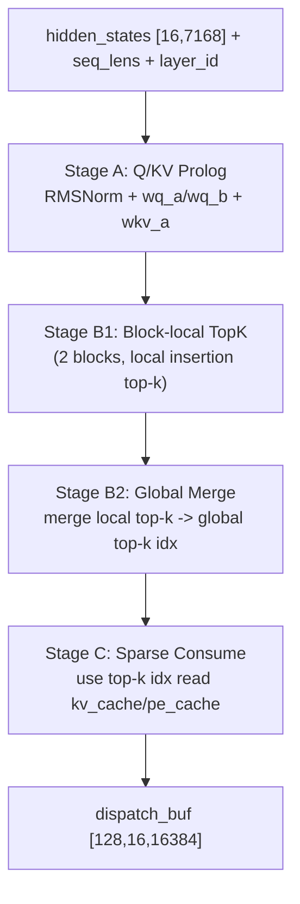
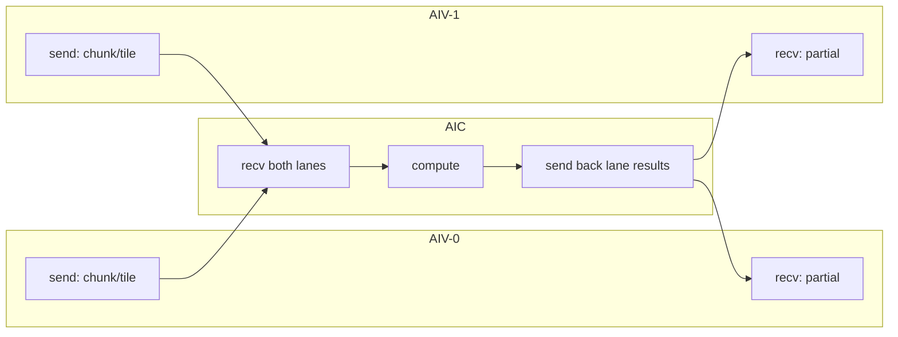

# DeepSeek v3.2 Decode Front Kernel Flow Analysis (Pass08)

## 1. Scope
- Source IR: `deepseek_v3_2_decode_front_dump/passes_dump/08_after_ExpandMixedKernel.py`
- Function: `deepseek_v3_2_decode_front_layer`
- Target shape: `BATCH=16`, decode step (`[16, 7168]`), dispatch output `[128, 16, 16384]`

## 2. High-level Pipeline
- **Stage A (Q/KV prolog)**: RMSNorm + `wq_a/wq_b` path生成Q相关中间结果；`wkv_a` path生成KV相关中间结果。
- **Stage B1 (block-local top-k)**: 在每个候选块内进行局部top-k插入排序（FP32评分，A5 FP8量化路径参与比较链路）。
- **Stage B2 (global merge)**: 合并B1局部top-k得到全局top-k索引。
- **Stage C (sparse consume)**: 使用top-k索引读取 `kv_cache/pe_cache`，完成稀疏注意力聚合，输出 `dispatch_buf`。

## 2.1 Flow Diagram

## 3. Pass08 Function Structure
- Orchestration入口：
  - `deepseek_v3_2_decode_front_layer`
- InCore group分解（AIC/AIV）：
  - `..._incore_0_group`: Q第一段prolog
  - `..._incore_1_group`: Q第二段投影/归一化
  - `..._incore_2_group`: KV投影/归一化
  - `..._incore_3_group`: top-k消费 + 稀疏注意力聚合

## 4. AIV/AIC Dataflow Signals
- 关键通信原语已展开可见：`tpush_to_aic` / `tpop_from_aic` / `tpush_to_aiv` / `tpop_from_aiv`。
- AIV运行时切分参数：`AIV_IDX`。
- 典型切分拼装模式：
  - `pl.tensor.assemble(..., [b0_0 + AIV_IDX * 2, ...])`
  - 说明batch维按2行子块切分回写（符合当前双路AIV分块策略）。

## 5. Fusion Interpretation
- 逻辑上保持“显式分阶段（A/B1/B2/C）+ 同scope融合”的实现意图。
- Pass08中仍表现为多个group调用，这是Lowering后的可调度形式，不改变前端融合语义目标。

## 6. Known Limitation
- 端到端codegen仍受阻于后端注册缺失：
  - `No codegen registered for operation: comm.aic_initialize_pipe`
- 该问题不影响本Pass08层面的流程与切分结构分析。

## 6.1 Capacity Budget (Source-side Guard)
- 源码侧采用软约束：`UB_SOFT_LIMIT_BYTES = 160 KB`。
- 估算峰值工作集：
  - `stage1_est_bytes = BATCH_TILE*K_CHUNK*4 + BATCH_TILE*LORA_CHUNK*4 + BATCH_TILE*Q_OUT_CHUNK*4 + BATCH_TILE*KV_OUT_CHUNK*4 + BATCH_TILE*LOCAL_PAD_WIDTH*2`
  - `stage2_est_bytes = 2*(1+2)*INDEX_TOPK*4 + KV_LORA_RANK*4 + QK_ROPE_HEAD_DIM*4 + V_HEAD_DIM*4`
  - `peak_est_bytes = max(stage1_est_bytes, stage2_est_bytes)`
- 当前配置（`BATCH_TILE=4, K_CHUNK=512, Q_OUT_CHUNK=512, KV_OUT_CHUNK=128, LORA_CHUNK=256, LOCAL_PAD_WIDTH=16384, INDEX_TOPK=2048`）下：
  - `stage1_est_bytes = 153600 B`
  - `stage2_est_bytes = 51968 B`
  - `peak_est_bytes = 153600 B`（`93.75%`，低于 160 KB）
  - `cube_tile_est_bytes = 536576 B`，`cube_usage_est = 51.17%`（相对 1MB soft limit）

## 7. Mixed Kernel AIV/AIC Side-by-Side Mapping

### 7.1 `incore_0_group` (Q prolog-1)
| AIV-0 | AIV-1 | AIC |
|---|---|---|
| `tpush_to_aic(wq_chunk_0, 0)` | `tpush_to_aic(wq_chunk_0, 1)` | `tpop_from_aiv(0/1)` 接收两路 `wq_chunk_0` |
| `tpush_to_aic(_t6, 0)` | `tpush_to_aic(_t6, 1)` | `tpop_from_aiv(0/1)` 接收两路 `_t6` |
| `tpop_from_aic(0)` 接收 `_t7` | `tpop_from_aic(1)` 接收 `_t7` | `tpush_to_aiv(__half0__,0)` / `tpush_to_aiv(__half1__,1)` |

### 7.2 `incore_1_group` (Q prolog-2)
| AIV-0 | AIV-1 | AIC |
|---|---|---|
| `tpush_to_aic(wq_chunk_5, 0)` | `tpush_to_aic(wq_chunk_5, 1)` | `tpop_from_aiv(0/1)` 接收两路 `wq_chunk_5` |
| `tpush_to_aic(_t10, 0)` | `tpush_to_aic(_t10, 1)` | `tpop_from_aiv(0/1)` 接收两路 `_t10` |
| `tpop_from_aic(0)` 接收 `_t11` | `tpop_from_aic(1)` 接收 `_t11` | `tpush_to_aiv(__half0__,0)` / `tpush_to_aiv(__half1__,1)` |

### 7.3 `incore_2_group` (KV prolog)
| AIV-0 | AIV-1 | AIC |
|---|---|---|
| `tpush_to_aic(wkv_chunk_0, 0)` | `tpush_to_aic(wkv_chunk_0, 1)` | `tpop_from_aiv(0/1)` 接收两路 `wkv_chunk_0` |
| `tpush_to_aic(_t14, 0)` | `tpush_to_aic(_t14, 1)` | `tpop_from_aiv(0/1)` 接收两路 `_t14` |
| `tpop_from_aic(0)` 接收 `_t15` | `tpop_from_aic(1)` 接收 `_t15` | `tpush_to_aiv(__half0__,0)` / `tpush_to_aiv(__half1__,1)` |

### 7.4 `incore_3_group` (TopK consume + sparse attention)
| AIV-0 | AIV-1 | AIC |
|---|---|---|
| `tpush_to_aic(_t50, AIV_IDX)`（各自一份） | `tpush_to_aic(_t50, AIV_IDX)`（各自一份） | `tpop_from_aiv()` 汇总读取 `_t50` |
| `tpush_to_aic(_t51, 0)` | `tpush_to_aic(_t51, 1)` | `tpop_from_aiv(0/1)` 读取 `_t51__h0/_h1` |
| `tpush_to_aic(wv_tile_0, 0)` + `tpush_to_aic(_t64, 0)` | `tpush_to_aic(wv_tile_0, 1)` + `tpush_to_aic(_t64, 1)` | `tpop_from_aiv(0/1)` 和 `tpop_from_aiv()` 消费，计算 `v_part` |
| `tpop_from_aic(0)` 接收 `v_part_0` | `tpop_from_aic(1)` 接收 `v_part_0` | `tpush_to_aiv(v_part_0)` |
| `tpop_from_aic()` 接收 `q_nope_latent_0` | `tpop_from_aic()` 接收 `q_nope_latent_0` | `tpush_to_aiv(q_nope_latent_0,0/1)` |

### 7.5 Communication Diagram (template for each mixed kernel)

### 7.6 `tfree` Lifecycle Notes
- 本文件对应的 Pass08 mixed kernels 中，通信后存在显式释放：
  - `pl.comm.tfree_to_aiv(...)`
  - `pl.comm.tfree_to_aic(...)`
- 典型位置覆盖 `incore_0/1/2/3` 各组，说明当前通信通道是“push/pop + tfree”成对管理，而不是只做收发不释放。

