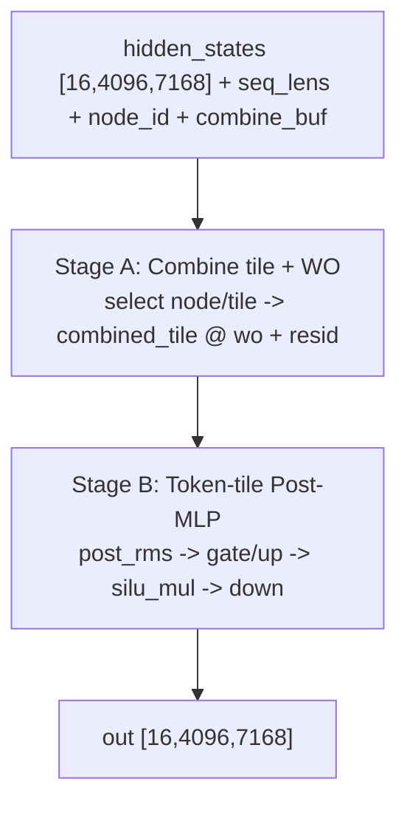
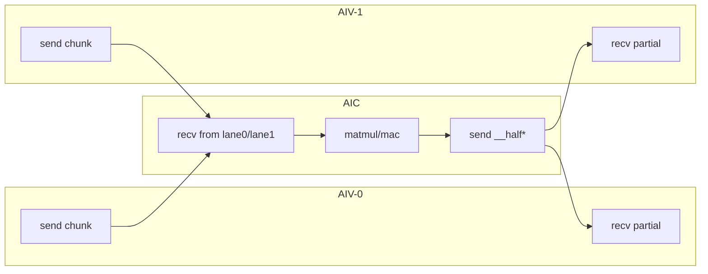

# DeepSeek v3.2 Prefill Back Kernel Flow Analysis (Pass08)

## 1. Scope
- Source IR: `deepseek_v3_2_prefill_back_dump/passes_dump/08_after_ExpandMixedKernel.py`
- Function: `deepseek_v3_2_prefill_back_layer`
- IO shape: input/output `[16, 4096, 7168]`, combine buffer `[128, 16, 4096, 16384]`

## 2. High-level Pipeline
- **Stage A (combine + WO)**:
  - 按 `node_id_t` 从 `combine_buf` 取当前节点tile，得到 `combined_tile`。
  - 计算 `combined_tile @ wo`，并与原 `hidden_states` 残差相加生成 `resid1_tile`。
- **Stage B (post-MLP)**:
  - 对每个token tile做 `post_rms -> gate/up -> silu_mul -> down`。
  - 最终与 `resid1_tile` 残差融合写回 `out`。

## 2.1 Flow Diagram

## 3. Pass08 Function Structure
- Orchestration：
  - `deepseek_v3_2_prefill_back_layer`
- InCore groups：
  - `..._incore_0_group`: WO路径 + 第一段残差
  - `..._incore_1_group`: down投影路径
  - `..._incore_2`: 最终out回写

## 4. Split/Communication Observation
- AIV runtime参数：`AIV_IDX`
- token维索引 `p0_0` 在prefill back中参与view偏移（区分decode back）。
- 典型assemble偏移：
  - `pl.tensor.assemble(..., [0 + AIV_IDX * 2, ...])`

## 5. Notes
- 该路径与decode back结构同源，主要差异是多了显式token维循环与tile搬运。
- 端到端codegen依旧受 `comm.aic_initialize_pipe` 注册缺失阻塞。
- `deepseek_v3_2_prefill_back_layer_incore_0/1` 的本地张量占用偏低，可作为融合放大优先候选：
  - 优先扩大 `auto_incore scope`，尝试将更多连续算子并入同一 in-core 段。
  - 其次调大 `CHUNK`（在容量许可范围内）以提高单次块计算覆盖。
  - 调参需与容量约束联动校验，避免超过UB预算导致策略回退。

## 6. Mixed Kernel AIV/AIC Side-by-Side Mapping

### 6.1 `incore_0_group` (`combined_tile @ wo` + resid)
| AIV-0 | AIV-1 | AIC |
|---|---|---|
| `tpush_to_aic(a_chunk_0, 0)` | `tpush_to_aic(a_chunk_0, 1)` | `tpop_from_aiv(0/1)` 接收 `a_chunk_0` |
| `tpush_to_aic(w_chunk_0, 0)` | `tpush_to_aic(w_chunk_0, 1)` | `tpop_from_aiv(0/1)` 接收 `w_chunk_0` |
| `tpop_from_aic(0)` 接收 `_t2` | `tpop_from_aic(1)` 接收 `_t2` | `tpush_to_aiv(__half0__,0)` / `tpush_to_aiv(__half1__,1)` |

### 6.2 `incore_1_group` (`w_down` projection)
| AIV-0 | AIV-1 | AIC |
|---|---|---|
| `tpush_to_aic(w_down_chunk_0, 0)` | `tpush_to_aic(w_down_chunk_0, 1)` | `tpop_from_aiv(0/1)` 接收 `w_down_chunk_0` |
| `tpop_from_aic(0)` 接收 `_t17` | `tpop_from_aic(1)` 接收 `_t17` | `tpush_to_aiv(__half0__,0)` / `tpush_to_aiv(__half1__,1)` |

### 6.3 Communication Diagram

### 6.4 `tfree` Lifecycle Notes
- Pass08 mixed kernels（`incore_0/1`）中可见：
  - `pl.comm.tfree_to_aiv(0/1)`
  - `pl.comm.tfree_to_aic(AIV_IDX)`
- 说明prefill back同样采用“收发+释放”配对的通道生命周期管理。

