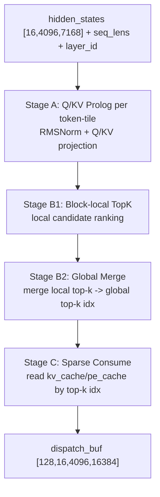
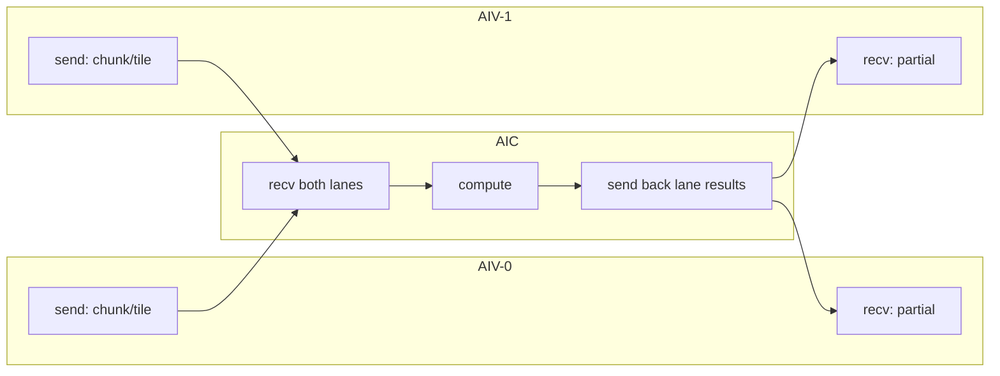

# DeepSeek v3.2 Prefill Front Kernel Flow Analysis (Pass08)

## 1. Scope

- Source IR: `deepseek_v3_2_prefill_front_dump/passes_dump/08_after_ExpandMixedKernel.py`
- Function: `deepseek_v3_2_prefill_front_layer`
- Target shape: `BATCH=16`, `MAX_SEQ=4096`, dispatch output `[128, 16, 4096, 16384]`

## 2. High-level Pipeline

- **Stage A (Q/KV prolog)**: 对 `[16, 4096, 7168]` 输入做按token块处理，完成RMSNorm和Q/KV投影准备。
- **Stage B1 (block-local top-k)**: 块内候选评分与局部top-k维护。
- **Stage B2 (global merge)**: 局部top-k合并为全局top-k索引。
- **Stage C (sparse consume)**: 依据top-k从cache读取并完成稀疏注意力聚合，写入dispatch缓冲。

## 2.1 Flow Diagram

## 3. Pass08 Function Structure

- Orchestration入口：
  - `deepseek_v3_2_prefill_front_layer`
- InCore group分解（AIC/AIV）：
  - `..._incore_0_group`: 融合后的Q/KV前处理（原0/1局部融合试验）
  - `..._incore_1_group`: top-k消费 + 注意力聚合

## 4. AIV/AIC Split Markers

- AIV runtime参数：`AIV_IDX`
- 关键拼装模式示例：
  - `pl.tensor.assemble(..., [0 + AIV_IDX * 2, ...])`
- Prefill路径中，token维 `p0_0` 参与了view/assemble偏移，体现按序列位置分块处理。

## 5. Decode/Prefill Alignment

- 与decode front保持同一“显式分阶段 + 同scope融合”的设计准则。
- Pass08拆为多group是编译调度形态，不改变该策略的语义一致性。

## 6. Known Limitation

- codegen阶段已知阻塞：
  - `No codegen registered for operation: comm.aic_initialize_pipe`

## 6.1 Capacity Budget (Source-side Guard)
- 源码侧采用软约束：`UB_SOFT_LIMIT_BYTES = 160 KB`。
- 估算峰值工作集：
  - `stage1_est_bytes = TOK_TILE*K_CHUNK*4 + TOK_TILE*LORA_CHUNK*4 + TOK_TILE*Q_OUT_CHUNK*4 + TOK_TILE*KV_OUT_CHUNK*4 + TOK_TILE*LOCAL_PAD_WIDTH*2`
  - `stage2_est_bytes = 2*(1+2)*INDEX_TOPK*4 + KV_LORA_RANK*4 + QK_ROPE_HEAD_DIM*4 + V_HEAD_DIM*4`
  - `peak_est_bytes = max(stage1_est_bytes, stage2_est_bytes)`
- 当前配置（`TOK_TILE=4, K_CHUNK=512, Q_OUT_CHUNK=256, KV_OUT_CHUNK=128, LORA_CHUNK=128, LOCAL_PAD_WIDTH=16384, INDEX_TOPK=2048`）下：
  - `stage1_est_bytes = 147456 B`
  - `stage2_est_bytes = 51968 B`
  - `peak_est_bytes = 147456 B`（`90.00%`，低于 160 KB）
  - `cube_tile_est_bytes = 270336 B`，`cube_usage_est = 25.78%`（相对 1MB soft limit）

## 7. Mixed Kernel AIV/AIC Side-by-Side Mapping

### 7.1 `incore_0_group` (Fused Q/KV prolog)
| AIV-0 | AIV-1 | AIC |
|---|---|---|
| `tpush_to_aic(wq_a_chunk_0, 0)` | `tpush_to_aic(wq_a_chunk_0, 1)` | `tpop_from_aiv(0/1)` 接收 `wq_a_chunk_0` |
| `tpush_to_aic(_t8, 0)` | `tpush_to_aic(_t8, 1)` | `tpop_from_aiv(0/1)` 接收 `_t8` |
| `tpush_to_aic(wq_b_chunk_0, 0)` | `tpush_to_aic(wq_b_chunk_0, 1)` | `tpop_from_aiv(0/1)` 接收 `wq_b_chunk_0` |
| `tpop_from_aic(0)` 接收 `_t10` | `tpop_from_aic(1)` 接收 `_t10` | `tpush_to_aiv(__half0__,0)` / `tpush_to_aiv(__half1__,1)` |

### 7.2 `incore_1_group` (TopK consume + sparse attention)
| AIV-0 | AIV-1 | AIC |
|---|---|---|
| `tpush_to_aic(_t50, AIV_IDX)`（各自一份） | `tpush_to_aic(_t50, AIV_IDX)`（各自一份） | `tpop_from_aiv()` 汇总读取 `_t50` |
| `tpush_to_aic(_t51, 0)` | `tpush_to_aic(_t51, 1)` | `tpop_from_aiv(0/1)` 读取 `_t51__h0/_h1` |
| `tpush_to_aic(wv_tile_0, 0)` + `tpush_to_aic(_t64, 0)` | `tpush_to_aic(wv_tile_0, 1)` + `tpush_to_aic(_t64, 1)` | `tpop_from_aiv(0/1)` 和 `tpop_from_aiv()` 消费，计算 `v_part` |
| `tpop_from_aic(0)` 接收 `v_part_0` | `tpop_from_aic(1)` 接收 `v_part_0` | `tpush_to_aiv(v_part_0)` |
| `tpop_from_aic()` 接收 `q_nope_latent_0` | `tpop_from_aic()` 接收 `q_nope_latent_0` | `tpush_to_aiv(q_nope_latent_0,0/1)` |

### 7.5 Communication Diagram (template for each mixed kernel)

### 7.6 `tfree` Lifecycle Notes
- 本文件对应的 Pass08 mixed kernels 中，通信后存在显式释放：
  - `pl.comm.tfree_to_aiv(...)`
  - `pl.comm.tfree_to_aic(...)`
- 典型位置覆盖 `incore_0/1` 两组，通信对象在AIV与AIC两侧都做了释放回收。

